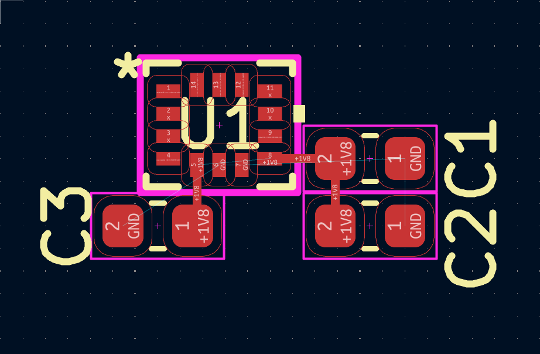

# Custom Flight Controller
A custom STM32-based flight controller designed from the ground up for quadcopters. This project includes PCB design using KiCad and embedded firmware using Ardupilot.

## Features
- STM32 Microcontroller
- 6-axis IMU
- Barometer
- USB-C
- PWM
- I2C and SPI

## Hardware
| Component | Part |
|-----------|------|
| MCU | STM32F405 |
| IMU | ICM-42688-P |
| Barometer | MS5611 |

## Status

- [ ] Hardware
  - [x] Select MCU
  - [x] Select IMU
  - [x] Select Barometer
  - [ ] Select connectors
  - [ ] Complete schematic
  - [ ] PCB layout
  - [ ] Design review
  - [ ] Order PCB
  - [ ] Assemble board
        
- [ ] Firmware
  - [ ] Configure Ardupilot
  - [ ] Build Ardupilot
  - [ ] Flash firmware

- [ ] Testing
  - [ ] Mission Planner
  - [ ] Flight test

## Design Decisions

### Why STM32F405?

The STM32F405 was selected because it provides:
- Sufficient processing power for flight control
- Native USB support
- Compatibility with ArduPilot
- Large community support

### Why SPI for IMU?

SPI was selected over I2C due to:
- Higher bandwidth
- Lower latency
- Better reliability for high-rate sensor data

## Lessons Learned

- SPI facilitates DMA, which offloads data transfers from the main MCU. This prevents processor lag.
-  IMU enhances GPS reliability in tunnels or areas with EM interference.
-  Each principal axis (pitch, roll, yaw) translates to accelerometer, gyroscope, and magnetometer.
-  Place smallest decoupling capacitors closest to pin first because smaller capacities filter out higher frequencies, which could travel across board.
  
## Goals

The objective of this project is to design a flight controller from scratch while learning PCB design, embedded systems, and hardware debugging.
