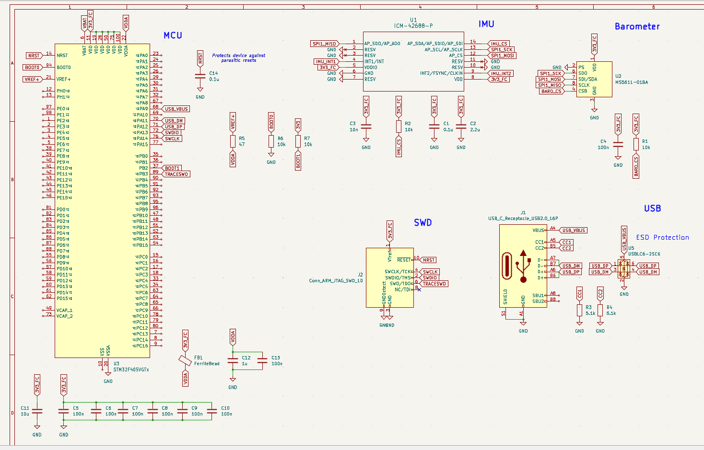
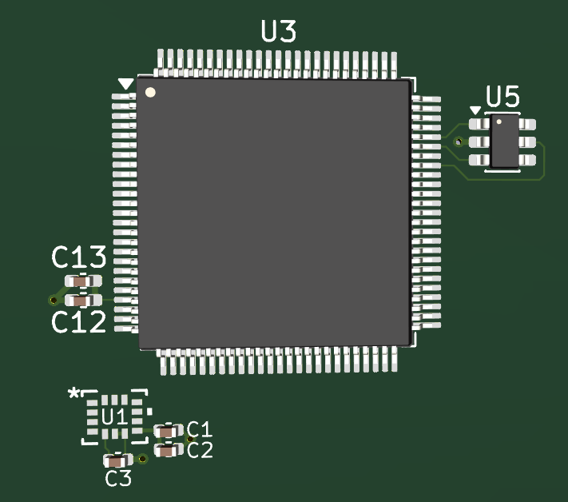

# STM32 Flight Controller Project
A custom STM32-based flight controller designed from the ground up for quadcopters. This project includes PCB design using KiCad and embedded firmware using Ardupilot.

## Features
- STM32 Microcontroller
- 6-axis IMU
- Barometer
- USB-C
- PWM
- I2C and SPI

## Hardware
| Component | Part |
|-----------|------|
| MCU | STM32F405, 168MHz, 1MB Flash |
| IMU | ICM-42688-P |
| Barometer | MS5611 |

## Status

- [ ] Hardware
  - [x] MCU Decoupling
  - [x] IMU Wiring
  - [x] Barometer Wiring
  - [X] USB-C Connection
  - [X] ESD Protection
  - [X] SWD Headers
  - [ ] Power management
  - [ ] ESC Pads
  - [ ] Complete schematic
  - [ ] PCB layout
  - [ ] Design review
  - [ ] Order PCB
  - [ ] Assemble board
        
- [ ] Firmware
  - [ ] Configure Ardupilot
  - [ ] Build Ardupilot
  - [ ] Flash firmware

- [ ] Testing
  - [ ] Mission Planner
  - [ ] Flight test

## Design Decisions

### STM32F405

The STM32F405 was selected because:
- Sufficient processing power for flight control
- Compatibility with ArduPilot
- Used in most commercial FCs, providing abundant documentation and examples

## Takeaways

- SPI facilitates DMA, which offloads data transfers from the main MCU. This prevents processor lag. SPI needs pull up resistors for CS since it sets CS low to select devices. Use GPIO for CS instead of built-in NSS so that ArduPilot can handle CS lines through software.
-  IMU enhances GPS reliability in tunnels or areas with EM interference.
-  Each principal axis (pitch, roll, yaw) translates to accelerometer, gyroscope, and magnetometer.
-  Place smallest decoupling capacitors closest to pin to minimize trace inductance. Smaller capacitors filter high frequency noise, and inductive impedance is proportial to frequency.
-  Vref serves as a precise baseline voltage for ADCs and DACs, isolating noise and maintaining consistent voltage.
-  ESD protection for USB connector as TVS array, where TVS diodes acts as an open circuit when operating voltage is normal. When a voltage spike occurs, it acts as a short circuit to sink high current and clamps D+/D-.
-  NRST puts chip in known state (setting registers to default), used to activate bootloader when flashing new program (ex: through SWD interface)
-  SWD bypasses bootloader and can reset and flash MCU directly
-  BOOT0 needs pull-down resistor to avoid floating. DFU mode is entered when BOOT0 is high, and BOOT1 can be permanently tied to ground.
  
## Goals

The objective of this project is to design a flight controller from scratch while learning PCB design, embedded systems, and hardware debugging.
